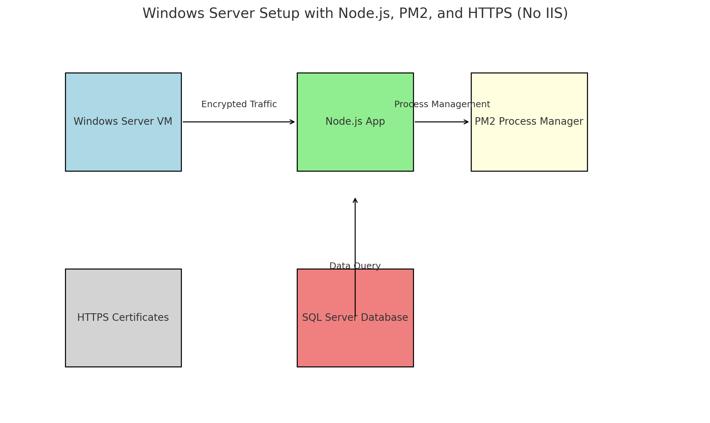
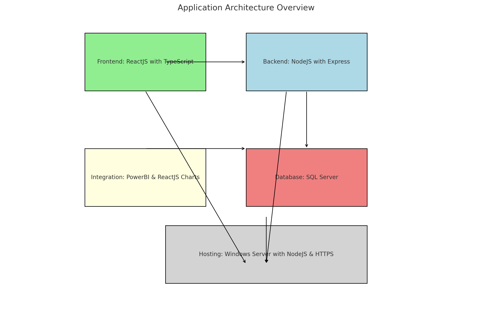
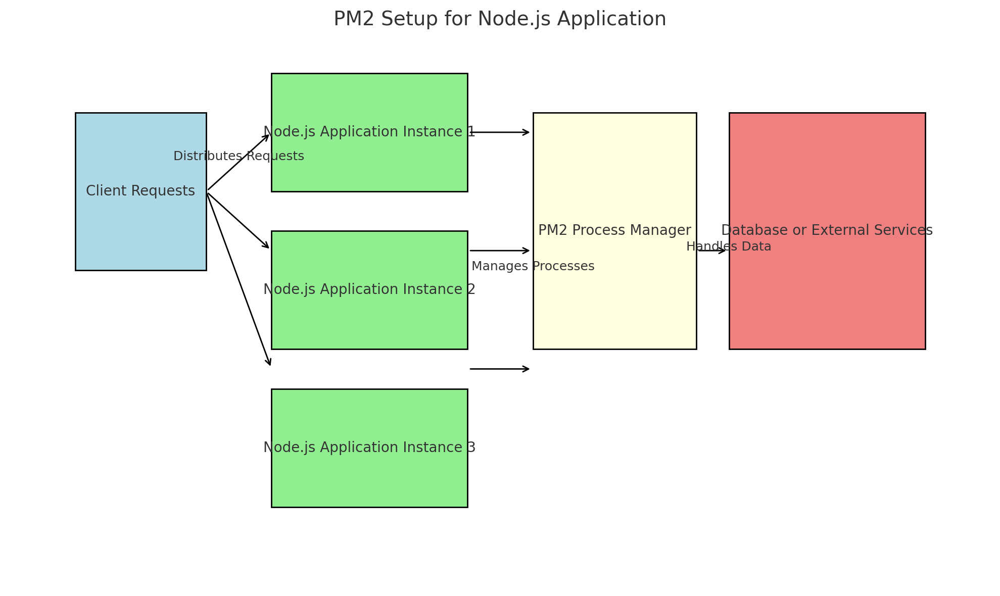

## **Apps Functionalities**

### 1. **Publicly Accessible Provider Search**
   **URL:** [HHS Providers Page](https://www.edoracases.com/hhsproviders)

   **Purpose:** 
   - A public resource for judges, parole officers, and court workers to quickly locate youth service providers.
   - Reduces friction in finding support for juveniles by providing detailed, searchable provider information.

   **Features to Highlight:**
   - **Search and Filters**: 
     - Ability to search by keywords or filter providers by service type, location, or eligibility criteria.
     - Example: Filtering providers who offer counseling or residential services.
   - **Detailed Provider Cards**:
     - Each card includes the provider’s name, address, phone number, email, and specific services offered.
     - Ensures quick access to actionable contact information without unnecessary navigation.
   - **Public Accessibility**:
     - Designed to be mobile-friendly and accessible from any browser.
     - Adheres to DHS security guidelines for publicly available resources.

   **Security Considerations:**
   - The page will:
     - Use HTTPS to encrypt all data.
     - Ensure no sensitive or internal DHS data is exposed.
     - Include rate-limiting and CAPTCHA (if needed) to prevent abuse.

---

### 2. **Juvenile Case Progress Dashboard**
   **URL:** [Client Page Grid Demo](https://www.edoracases.com/demos/clientpagegrid)

   **Purpose:** 
   - A private resource for judges, parole officers, and court workers to track juveniles’ progress post-commitment.
   - Reduces reliance on DYS staff to relay updates via phone or email.

   **Features to Highlight:**
   - **Individualized Dashboards**:
     - Each court personnel will have a personalized view of the juveniles they’ve committed.
     - Displays key information such as current placements, progress updates, and uploaded documents.
   - **Document Management**:
     - Allows court staff to view and download important documents directly.
     - Saves time for both DYS employees and court personnel.
   - **Progress Updates**:
     - Tracks milestones, compliance with court orders, and service engagement.
     - Helps court staff monitor outcomes and identify potential concerns proactively.

   **Security Considerations:**
   - This page will:
     - Be secured behind a login system integrated with DHS’s Active Directory or other authentication services.
     - Use role-based access controls (RBAC) to ensure court personnel can only view the juveniles they are authorized to follow.
     - Audit user actions to maintain accountability and prevent data misuse.

---

## **Development Server Setup**
   - **Purpose**: Build and refine both pages in a secure, isolated environment before public deployment.
       - [View Development Server Overview](STAGING/1-DEVSERVER.MD)   
       - [View Dev/IIS Server Setup](STAGING/0-NODEJS-WINDOWS-SETUP.MD)
       - 

       - 

       
   - **Security Features**:
     - HTTPS enabled for all internal environments.
     - Firewall rules to restrict access to the development server.
     - Regular vulnerability scans using tools like `npm audit` or Snyk.

   - **Workflow**:
     1. Build features on the development server.
     2. Conduct internal reviews and testing.
     3. Push to a staging server for final approval.
     4. Deploy to the public server for live access.

---

## **Key Talking Points**
1. **Aligning with DHS's Mission:**
   - The Provider Search and Juvenile Case Progress Dashboard directly address gaps in accessibility and operational efficiency.
   - These tools empower court personnel and reduce the burden on DYS staff.

2. **Security is a Priority:**
   - Both pages follow DHS's strict security protocols:
     - Publicly accessible pages (Provider Search) are hardened against abuse.
     - Private pages (Juvenile Case Progress) use robust authentication and data access controls.

3. **Modular and Future-Proof Design:**
   - Built with ReactJS and NodeJS for modularity and scalability.
   - New features can be added with minimal disruption, ensuring the solution remains adaptable to DHS’s evolving needs.

4. **Enterprise Integration:**
   - The dashboards and tools can integrate seamlessly with existing DHS systems (e.g., PowerBI, SQL Server).
      - [View PowerBI Integration](MODULARITY-POWERBI/4-REACTJS-POWERBI.MD)         
   - Demonstrates how NodeJS and ReactJS complement DHS's technology stack, offering flexibility IIS and ASP.Net can't match.
     - [View NodeJS Hosting Role](STAGING/3-NODEJS-SSL-RELIANCE.MD)   
---

## **Examples for Walkthrough**

1. **Focus on Real-World Scenarios**:
   - Demonstrate how a parole officer might search for a provider in their area.
   - Show a judge logging into the dashboard to review a juvenile’s progress without contacting DYS staff.

2. **Emphasize Accessibility**:
   - Highlight the simplicity of the interfaces.
   - Show how quickly tasks can be accomplished compared to traditional workflows.

3. **Address Security Head-On**:
   - Walk through authentication for the dashboard.
   - Showcase HTTPS in action.
   - Explain how user roles are restricted to prevent unauthorized data access.

4. **Demonstrate ReactJS’s Strengths**:
   - Compare the flexibility of ReactJS for embedding charts and customizing dashboards versus the rigidity of PowerBI.
   - Show a side-by-side example if possible (e.g., a ReactJS chart integrated into the dashboard versus an embedded PowerBI dashboard).
---
## **DYS Solution Outline**

### 1. **Introduction**
   - The DYS Solution is meticulously designed to align with the rigorous standards and enterprise guidelines established by the Department of Human Services (DHS). This alignment ensures not only compliance with regulatory frameworks but also seamless integration with existing DHS infrastructure. By adhering to these standards, the solution prioritizes data security, system reliability, and user accessibility, addressing the critical needs of the department. 
   - Its scalable architecture supports future growth, while modern web development methodologies guarantee a responsive, efficient, and intuitive user experience. This thoughtful design approach underscores a commitment to maintaining operational consistency while driving innovation.

---
### 2. **System Architecture Overview**
   - **Diagram**: Present a visual architecture including:
     - **Frontend**: ReactJS with TypeScript for reusable, component-based development.
     - **Backend**: NodeJS with Express for server-side logic and API handling.
     - **Database Layer**: SQL Server, compatible with DHS’s existing infrastructure.
     - **Integration Points**: PowerBI for high-level dashboards, ReactJS charts for embedded interactivity.
     - **Hosting**: Windows Server with NodeJS, secured via HTTPS.
     - 

   - **Comparison to IIS**:
     - Explain NodeJS's role in replacing IIS for hosting applications.
     - Highlight the benefits of NodeJS, such as better scalability, lighter footprint, and modern ecosystem.
     - [View NodeJS Hosting Role](STAGING/3-NODEJS-SSL-RELIANCE.MD)
---

### 3. **Security Implications**
   - **NodeJS Security Best Practices**:
     - Enforced HTTPS using DHS-approved certificates.
       - [View HTTPS](STAGING/2-NODEJSHTTPS.MD)     
     - Middleware implementation for rate limiting, CSRF, and input validation.
       - [View Middleware](STAGING/9-NODEJS-MIDDLEWARE-SEC.MD)
     - Dependency audits using `npm audit` and third-party tools (e.g., Snyk).
       - [View Audits Scanning](STAGING/7-NODEJS-SCANS.MD)     
   - **Service Management**:
     - Use PM2 or Windows Service Manager for process monitoring and auto-recovery.
       - [View PM2 Process Manager](STAGING/4-NODEJS-PM2-TOOL.MD)     
       - 

   - **Compliance**:
     - TypeScript’s static typing ensures secure and maintainable code.
       - [View Typescript Compliance](COMPLIANCE-OWASP/2-TYPESCRIPT-COMPLIANCE.MD)     
     - OWASP-aligned development practices.
       - [View OWASP Compliance](COMPLIANCE-OWASP/3-OWASP-COMPLIANCE.MD)     
       - [View OWASP Ensuring](COMPLIANCE-OWASP/5-OWASP-ENSURING-PRACTICE.MD)     
     - Secure authentication and authorization mechanisms.
       - [View Mechanisms](COMPLIANCE-OWASP/4-AUTHENTICATION-SECURITY.MD)          
---

### 4. **Enterprise Compatibility**
   - **ReactJS vs. PowerBI**:
     - **Modularity**:
       - ReactJS charts (e.g., Chart.js, D3.js, or Recharts) are fully customizable. Developers can tailor components to fit the exact needs of a web page, seamlessly blending with other UI elements.
          - [View Modularity](MODULARITY-POWERBI/1-MODULARITY.MD)
       - PowerBI requires embedding entire dashboards, which can feel siloed and lacks fine-grain control over specific visual elements.
     - **Web Development Flexibility**:
       - ReactJS components integrate directly into the frontend codebase, adapting dynamically to the application's needs.
          - [View Flexibility](MODULARITY-POWERBI/2-REACTJS-FLEXIBILITY.MD)                
       - PowerBI is primarily a business intelligence platform, not a flexible web development tool. It often necessitates workarounds for customization, limiting rapid development cycles.
     - **Platform Independence**:
       - ReactJS charts work in any browser or device without needing proprietary platforms.
       - PowerBI relies on Microsoft’s ecosystem, creating dependency and limiting innovation outside its predefined scope.
   - **Windows Server Integration**:
     - Describe NodeJS process management on Windows Server using PM2 or running NodeJS as a Windows service.
       - [View PM2 Process Manager](STAGING/4-NODEJS-PM2-TOOL.MD.MD)          
     - Integration of HTTPS certificates directly into the NodeJS application.
---

### 5. **Development and Deployment Workflow**
   - **Development Practices**:
     - Use of ReactJS for its component-based, modular architecture.
     - TypeScript for robust, maintainable code.
   - **Deployment**:
     - Hosting via Windows Server, using NodeJS and Express.
     - Configuration of a reverse proxy (e.g., IIS or Nginx) to handle requests.
   - **Logging and Monitoring**:
     - NodeJS tools like Winston for logs.
     - Integration with centralized monitoring platforms (e.g., Splunk).

---

### 6. **Performance and Scalability**
   - **ReactJS and NodeJS Advantages**:
     - NodeJS’s non-blocking architecture ensures faster request handling and better scalability compared to traditional IIS setups.
     - ReactJS components are optimized for high performance with features like virtual DOM rendering and code splitting.
   - **Comparison to PowerBI**:
     - ReactJS charts load directly as part of the frontend application, ensuring faster interaction compared to the embedded PowerBI dashboards.
     - PowerBI's heavy reliance on external APIs and authentication layers can introduce latency.

---

### 7. **Demonstration of Functionality**
   - Prepare a live demo showcasing:
     - Core features of the DYS Solution.
     - How ReactJS charts (e.g., Chart.js or D3.js) integrate into a web page, offering dynamic and responsive visualizations.
     - Example of embedding PowerBI (to show it’s possible) versus ReactJS charts (to emphasize flexibility and speed).
     - Backend processing with NodeJS and Express.

---

### 8. **Next Steps**
   - **Pilot Program**:
     - Deploy the DYS Solution in a sandbox for testing.
     - Conduct security audits and load tests.
     - Gather feedback and adjust as needed.
   - **Roadmap**:
     - Full implementation after successful pilot.
     - Long-term integration with DHS enterprise systems.

---

## **ReactJS Charts vs. PowerBI: Proof Points**
1. **Modularity**:
   - ReactJS charting libraries allow you to:
     - Combine multiple chart types on a single page.
     - Add custom interactions (tooltips, zoom, annotations).
     - Style charts to match your application’s theme seamlessly.
   - PowerBI, while powerful, is less modular. Embedding a single chart often requires embedding an entire dashboard, which may not match the rest of the webpage.

2. **Web Development Workflow**:
   - ReactJS charts are integrated into the development process as reusable components. This allows:
     - Version control with the rest of the codebase.
     - Custom data sources without platform constraints.
   - PowerBI workflows are separate from application development, requiring additional configurations and reliance on Microsoft platforms.

3. **Performance**:
   - ReactJS charts are optimized for the web, loading directly as part of the frontend.
   - PowerBI dashboards often require significant data pre-processing and API requests, leading to slower load times.

4. **Platform Independence**:
   - ReactJS works on any platform with a browser.
   - PowerBI ties you to Microsoft’s ecosystem, creating dependencies and potential licensing costs.

---

## **Prove the Security and Integration of NodeJS**
1. **Demo HTTPS Setup**:
   - Show how to configure HTTPS certificates in NodeJS.
   - Use DHS’s internal Certificate Authority to demonstrate compatibility.

2. **Service Management**:
   - Demonstrate PM2 managing NodeJS processes on Windows Server.
   - Explain clustering for performance and fault tolerance.

3. **Mock Attacks**:
   - Simulate XSS or CSRF attacks and show how your middleware prevents them.
   - Highlight rate limiting to protect against brute force and DDoS attacks.

---

