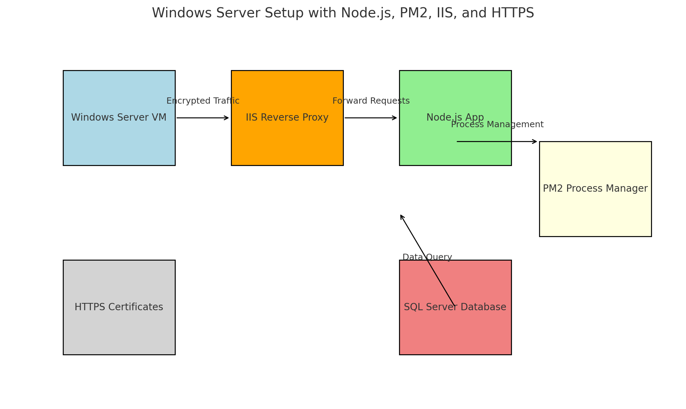

# **Division of Youth Services Solution Outline**
## **Key Talking Points**
1. **Aligning with DYS's Mission:**
   - The Provider Search and Juvenile Case Progress Dashboard directly address gaps in accessibility and operational efficiency.d
   - These tools empower court personnel and reduce the burden on DYS staff.
2. **Security is a Priority:**
   - Both pages follow DHS's strict security protocols:
     - Publicly accessible pages (Provider Search) are hardened against abuse.
     - Private pages (Juvenile Case Progress) use robust authentication and data access controls.
3. **Modular and Future-Proof Design:**
   - Built with ReactJS and NodeJS for modularity and scalability.
   - New features can be added with minimal disruption, ensuring the solution remains adaptable to DHS’s evolving needs.
---

## **Apps Functionalities**
### 1. **Publicly Accessible Provider Search**
   **URL:** [HHS Providers Page](https://www.edoracases.com/hhsproviders)

   **Purpose:** 
   - A public resource for judges, parole officers, and court workers to quickly locate youth service providers.
   - Reduces friction in finding support for juveniles by providing detailed, searchable provider information.

   **Features to Highlight:**
   - **Search and Filters**: 
     - Ability to search by keywords or filter providers by service type, location, or eligibility criteria.
     - Example: Filtering providers who offer counseling or residential services.
   - **Detailed Provider Cards**:
     - Each card includes the provider’s name, address, phone number, email, and specific services offered.
     - Ensures quick access to actionable contact information without unnecessary navigation.
   - **Public Accessibility**:
     - Designed to be mobile-friendly and accessible from any browser.
     - Adheres to DHS security guidelines for publicly available resources.

   **Security Considerations:**
   - The page will:
     - Use HTTPS to encrypt all data.
     - Ensure no sensitive or internal DHS data is exposed.
     - Include rate-limiting and CAPTCHA (if needed) to prevent abuse.

---
### 2. **Juvenile Case Progress Dashboard**
   **URL:** [Client Page Grid Demo](https://www.edoracases.com/demos/clientpagegrid)

   **Purpose:** 
   - A private resource for judges, parole officers, and court workers to track juveniles’ progress post-commitment.
   - Reduces reliance on DYS staff to relay updates via phone or email.

   **Features to Highlight:**
   - **Individualized Dashboards**:
     - Each court personnel will have a personalized view of the juveniles they’ve committed.
     - Displays key information such as current placements, progress updates, and uploaded documents.
   - **Document Management**:
     - Allows court staff to view and download important documents directly.
     - Saves time for both DYS employees and court personnel.
   - **Progress Updates**:
     - Tracks milestones, compliance with court orders, and service engagement.
     - Helps court staff monitor outcomes and identify potential concerns proactively.

   **Security Considerations:**
   - This page will:
     - Be secured behind a login system integrated with DHS’s Active Directory or other authentication services.
     - Use role-based access controls (RBAC) to ensure court personnel can only view the juveniles they are authorized to follow.
     - Audit user actions to maintain accountability and prevent data misuse.

---

## **Development Server Setup**
   - **Purpose**: Build and refine both pages in a secure, isolated environment before public deployment.
       - [View Development Server Overview](STAGING/1-DEVSERVER.MD)   
       - [View Dev/IIS Server Setup](STAGING/0-NODEJS-WINDOWS-SETUP.MD)
       - 

       - 

       
   - **Security Features**:
     - HTTPS enabled for all internal environments.
     - Firewall rules to restrict access to the development server.
     - Regular vulnerability scans using tools like `npm audit` or Snyk.

   - **Workflow**:
     1. Build features on the development server.
     2. Conduct internal reviews and testing.
     3. Push to a staging server for final approval.
     4. Deploy to the public server for live access.

---

## **ReactJS Charts vs. PowerBI: Proof Points**
1. **Modularity**:
   - ReactJS charting libraries allow you to:
     - Combine multiple chart types on a single page.
     - Add custom interactions (tooltips, zoom, annotations).
     - Style charts to match your application’s theme seamlessly.
   - PowerBI, while powerful, is less modular. Embedding a single chart often requires embedding an entire dashboard, which may not match the rest of the webpage.

2. **Web Development Workflow**:
   - ReactJS charts are integrated into the development process as reusable components. This allows:
     - Version control with the rest of the codebase.
     - Custom data sources without platform constraints.
   - PowerBI workflows are separate from application development, requiring additional configurations and reliance on Microsoft platforms.

3. **Performance**:
   - ReactJS charts are optimized for the web, loading directly as part of the frontend.
   - PowerBI dashboards often require significant data pre-processing and API requests, leading to slower load times.

4. **Platform Independence**:
   - ReactJS works on any platform with a browser.
   - PowerBI ties you to Microsoft’s ecosystem, creating dependencies and potential licensing costs.

---

## **Prove the Security and Integration of NodeJS**
1. **Demo HTTPS Setup**:
   - Show how to configure HTTPS certificates in NodeJS.
   - Use DHS’s internal Certificate Authority to demonstrate compatibility.

2. **Service Management**:
   - Demonstrate PM2 managing NodeJS processes on Windows Server.
   - Explain clustering for performance and fault tolerance.

3. **Mock Attacks**:
   - Simulate XSS or CSRF attacks and show how your middleware prevents them.
   - Highlight rate limiting to protect against brute force and DDoS attacks.

---

